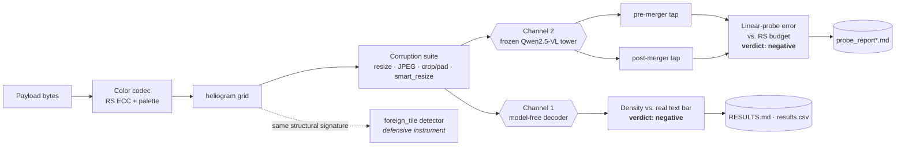
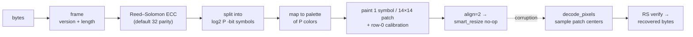

# heliogram

> A defensive-security research artifact built around a measured negative result: can a
> patch-aligned optical codec carry high-entropy bytes more cheaply than text through a
> self-hosted vision-language model? Measured on two independent channels — no.

## Summary

heliogram encodes arbitrary bytes as a grid of solid-color 14×14 blocks — one symbol per
ViT patch, protected by Reed–Solomon ECC — to test one economic hypothesis: could such a
patch-aligned optical codec pack more payload bits per vision token than base64/ascii85 text
costs per text token, making encoded images a cheaper context medium for a self-hosted VLM
(target: **Qwen2.5-VL**)? The hypothesis was measured, not assumed, on two independent
channels, and **both say no**: the codec's own density ceiling sits below the real
tokenizer's text bar, and the model's own vision pipeline actively discards the per-patch
structure before any language model sees it. What survives the negative result is the
instrumentation built to reach it — a model-free **pre-ingest detector** (with a measured
adversarial blind spot), a reusable pre/post-merger **information-localization probe method**,
and a **threat model** scoped to Qwen2.5-VL. All data is synthetic and seed-deterministic.
Apache-2.0.

## Architecture

The project is a two-channel measurement design: encode a payload, push it through a realistic
corruption suite, then ask two independent questions — *is it dense enough?* (model-free) and
*does the structure survive the model?* (frozen tower + linear probe). A defensive detector is
built from the same structural signature the codec produces.



## Pipeline

The codec's encode → wire → decode path. `align=2` rounds the grid to even patch dimensions so
Qwen2.5-VL's mandatory `smart_resize` becomes a no-op (a real robustness finding — without it,
decode drops to zero); the reference decoder samples patch centers only, deliberately measuring
the channel rather than decoder cleverness.



## Results at a glance

Both channels return negative. The codec's net density ceiling falls below *every* measured text
baseline, and at the LM boundary (post-merger) the linear probe sits at/near chance — a real
partial signal exists on the raw ViT blocks (pre-merger) but the patch merger erases it.

| Channel | What was measured | Result | Bar / budget | Verdict |
|---|---|---:|---|:--:|
| 1 — density | Net codec ceiling, `subpatch=1` (bits/patch) | **6.996** | 8.096 base64 · 8.374 ascii85 (bits/token) | ❌ below every text bar |
| 2 — post-merger | Probe error at LM boundary (3B, palette 16, clean) | **0.7358** | 0.0627 RS budget · 0.9375 chance | ❌ at/near chance |
| 2 — pre-merger | Probe error on ViT-block output (3B, palette 16, clean) | **0.1344** | 0.0627 RS budget · 0.9375 chance | ⚠️ partial signal, then erased by merger |

Full sweep tables and the per-tap-point breakdown are in the detailed discussion below.

### Read next

- **The verdict without the sweep tables** — [`docs/FINDINGS.md`](docs/FINDINGS.md)
- **Full paper-style report** (background, methods, discussion) — [`docs/writeup.md`](docs/writeup.md)
- **Defensive framing** (what the detector catches, what it does not, scope) — [`docs/THREAT-MODEL.md`](docs/THREAT-MODEL.md)
- **Raw measurement logs** — [`RESULTS.md`](RESULTS.md) / `results.csv`
- **Wire format** — [`spec/format-v0.1.md`](spec/format-v0.1.md)

---

## Overview

**Primarily, this is a defensive-security research artifact: a structural,
model-free pre-ingest detector for heliogram-like payloads (now with a measured
adversarial blind spot), a threat model scoped to Qwen2.5-VL, and a reusable
information-localization probe method for finding where a patch-merging
vision-language model loses structured per-patch signal. Building those
instruments started from an economic question — could a patch-aligned optical
codec make encoded images a cheaper context medium than text for self-hosted
VLMs? — and the measured answer, on two independent channels, is no. That
negative result is kept here in full, as the secondary result that motivated
the instruments above.**

heliogram encodes arbitrary bytes as a grid of solid-color 14×14 blocks (one
symbol per ViT patch), protects them with Reed–Solomon ECC, runs them through the
corruptions a real serving pipeline applies (resize, JPEG, crop/pad, and the
target model's own preprocessing), and measures how much survives — first with a
model-free reference decoder, then through a real, frozen Qwen2.5-VL vision tower.
The hypothesis was that a code *designed for the patch channel*, with explicit
ECC instead of a language model's implicit denoising, might carry high-entropy
bytes more cheaply than base64/ascii85 text does. It does not, and the repository
documents why, in the same measured, caveat-attached style throughout. That same
measurement work — recovering a tower's own window-shuffle permutation from its
outputs, tapping both sides of the patch merger, and scoring linear-probe error
against a task-derived decision budget — is what generalizes into the reusable
probe method above; and the exact structural signature the codec produces
(even patch tiling, near-solid cells) is what the pre-ingest detector in
[`docs/THREAT-MODEL.md`](docs/THREAT-MODEL.md) is built to catch.

Apache-2.0. All data is synthetic and seed-deterministic.

## The question

A self-hosted VLM operator who controls preprocessing end to end can hand the
model arbitrary encoded data as "context." Each side has a well-defined unit of
account: text sent as base64/ascii85 costs BPE tokens at a measurable
bits-per-token rate, and one ViT patch is roughly one vision token when the
operator controls patching. So the question is exact and answerable: **for
high-entropy bytes that must be recovered exactly (a key, a hash, a binary blob —
no redundancy for a language model's prior to lean on), is it cheaper to send
pixels or text?**

Optical compression is known to pay off for *prose* — DeepSeek-OCR and Glyph
exploit exactly that, and it works because a language model's prior fills the gaps
an imperfect optical read leaves. heliogram asked whether the same idea survives
when the payload is high-entropy and every symbol must be bit-exact. Two channels
were tested end to end.

## The answer: negative, on both channels

**Channel 1 — the color codec — loses on density before robustness even matters.**
The only VLM-meaningful regime is one symbol per patch (`subpatch=1`); its hard
architectural ceiling is `log2(palette)`, reaching 8 bits only at `palette=256`.
Reed–Solomon and calibration-row overhead cap the achievable *net* ceiling at
`log2(256) × 223/255 ≈ 6.996 bits/patch` (measured max in the sweep: 6.827, at
palette=256/16KB). The text bar was **measured, not assumed** — the real
Qwen2.5-VL tokenizer (`transformers==5.13.0`) over base64/ascii85/base85/hex:

| Text encoding | bits/token (measured) |
|---|---:|
| ascii85 | **8.374** |
| base85 | 8.178 |
| base64 | 8.096 |
| hex | 4.534 |

Since 6.996 < 8.096 < 8.374, no `subpatch=1` config can beat *any* text baseline
on per-patch density. The sweep confirms it directly: 0 of 64 `subpatch=1` configs
beat even the weakest (base64) bar clean, and a byte-granular token-count scan up
to 64KB finds no `subpatch=1` crossing below base64 token count anywhere — the
best ratio observed is 1.16, i.e. 16% *more* tokens than base64. (An earlier
revision of this README reported the codec "beating base64" against an *analytic*
~6.0 bits/token estimate; measuring the real tokenizer removed that margin
entirely. That correction is the headline.)

**Channel 2 — the model's own vision pipeline discards the structure.** The
harness only measures a model-free pixel decoder; it cannot say whether a real
tower even carries the information to the language model. A frozen-tower linear
probe (`scripts/run_probe.py`, `heliogram/probe.py`) closes that gap: push
heliogram grids through the stock, frozen Qwen2.5-VL vision tower and train a
linear probe from token embeddings to ground-truth patch symbols. A probe at or
below the RS symbol-error budget (6.27%) means the information survives to that
point; a probe at chance means no *linearly decodable* per-patch signal survives
to this tap point — a higher-capacity or nonlinear probe could differ (see
docs/FINDINGS.md §5).

| Tap point | Model | Palette | Corruption | Probe error | RS budget | Chance | Verdict |
|---|---|---:|---|---:|---:|---:|---|
| post-merger | 3B | 16 | clean | 0.7358 | 0.0627 | 0.9375 | at/near chance |
| post-merger | 7B | 16 | clean | 0.6551 | 0.0627 | 0.9375 | at/near chance |
| post-merger | 7B | 256 | clean | 0.8979 | 0.0627 | 0.9961 | at/near chance |
| **pre-merger** | 3B | 16 | clean | **0.1344** | 0.0627 | 0.9375 | partial signal |
| pre-merger | 3B | 16 | jpeg_q70 | 0.1902 | 0.0627 | 0.9375 | partial signal |
| pre-merger | 3B | 256 | clean | 0.8081 | 0.0627 | 0.9961 | at/near chance |

Reading the two tap points together *is* the finding. Post-merger — the embedding
a language model actually consumes — every palette on both 3B and 7B is at/near
chance. Pre-merger (directly on ViT-block output) splits by palette: at
`palette=16` the vision blocks preserve a real partial signal (13.4% error, well
below chance, degrading only to 19.0% under JPEG q70), but the 2×2 merger MLP then
erases most of it (13.4% → 65.5–73.6% post-merger). At `palette=256` the vision
blocks have already destroyed the finer color structure themselves, before the
merger runs (80.8% pre-merger). Scale does not rescue it (3B→7B moves palette=16
from 73.6% to 65.5%, nowhere near the 6.27% budget), which points to an
architectural bottleneck, not a capacity limit more parameters relieve.

This is the route the earlier roadmap called "the entire load-bearing wall of the
project's economic case" — reading multiple patch-symbols out of one merged LM
token. The probe measured it directly and it is not there. The fine-tune that
route implied is therefore **not pursued**; the cheap Step-0 experiment that would
have gated it came back negative for tens of dollars, exactly as intended. (A
narrower question the frozen-tower probe does not settle — whether a *cheaply
trained* merger, rather than the stock frozen one, could carry the pre-merger
partial signal through to the LM boundary — is staged as a designed,
refuse-without-model go/no-go that has not been run here; see the Reproducing
section and `scripts/train_merger_adapter.py`.)

**The typography pivot fails too, for a different reason.** The natural fallback —
render the payload as dense typeset ascii85, the channel towers demonstrably read
— clears its geometric gate but fails a zero-shot OCR measurement. A stock 7B
reads 28px text at 96% accuracy (1.94 bits/patch), but readability and density are
inversely coupled through font size and cross on the wrong side of the bar: the
sizes the tower reads sit ~4× *below* the 8.374 bar, and the only size that beats
it (12px, 9.75 bits/patch) is illegible (60% CER). This is the same underlying
reason: optical compression pays for redundant prose, not for high-entropy bytes
where every character must be exact.

## Why (one mechanism, both channels)

A VLM's perception is a strong learned prior over natural images and typeset text,
not a general-purpose lossless channel for machine-designed symbolic structure.
The vision blocks partially tolerate coarse out-of-distribution color structure
and progressively discard finer color depth; the patch-merger, whose job is to
fold four patch embeddings into one, has no reason to preserve per-patch identity
and destroys most of what survives. Typography fails on geometry rather than
perception, but lands in the same place. The training signal that makes a VLM good
at reading real-world content is exactly what discards the dense, non-prose
structure such a scheme needs — which bounds, generally, what patch-aligned or
typographic optical-context schemes can gain for *exact byte recovery* on a model
whose perception was trained on natural images and prose.

## What survives the negative result

Two byproducts are worth keeping regardless of the verdict:

- **The exactness niche.** Reed–Solomon gives detection *and* correction on every
  successful decode; a raw VLM transcription of rendered text gives neither unless
  a checksum/ECC layer is bolted on — at which point it has reinvented what
  heliogram already has natively. This holds even where rendered-text OCR density
  matches the codec's, because exactness and density are different axes.
- **The information-localization probe method.** Recovering a tower's
  window-shuffle permutation from its own outputs by exact row-matching (no
  private `transformers` internals), tapping both sides of the merger boundary,
  and scoring linear-probe error against an explicit, task-derived decision budget
  is a reusable way to locate *where* in any patch-merging VLM a given structured
  signal is lost — independent of whether the answer turns out favorable.

## Scope

- **In scope:** self-hosted / open-weight VLMs where the operator controls image
  preprocessing end to end. Every number here is specific to **Qwen2.5-VL** (3B
  and 7B, `transformers==5.13.0`).
- **Out of scope:** closed API models. Their preprocessing is opaque and
  changeable, so no claim here transfers to them; they are not tested.

## How it works (v0.1)

Payload bytes are framed (version byte + 4-byte length), Reed–Solomon coded
(default 32 parity bytes), split into `log2(P)`-bit symbols for a palette
`P ∈ {2,…,256}` of deterministic, maximally separable colors, and painted one
symbol per 14×14 patch on a roughly square grid. Row 0 is a calibration row
cycling the palette so the decoder can recover post-corruption RGB values and
nearest-neighbor classify data patches. `encode(..., align=2)` rounds the grid to
even patch dimensions so Qwen2.5-VL's mandatory `smart_resize` (which snaps
resolution to 28px multiples) becomes a no-op, with zero wire-format change — a
real robustness finding, since without it the snap resamples data rows off the
symbol lattice and drops decode to zero (`tests/test_smart_resize.py`,
`spec/format-v0.1.md` §6). The reference decoder (`decode_pixels`) samples patch
centers only — deliberately dumb, so it measures the channel, not decoder
cleverness. `subpatch>1` (k×k sub-cells per patch) is a pixel-decoder-only
geometric ceiling with no evidence a real ViT resolves sub-patch structure; it is
documented but never treated as a VLM capability claim.

## Instruments

Model-free measurement tools, each characterizing the channel or the reference
decoder rather than a VLM. Any path that would need a real model raises rather
than fabricate a number.

- **`heliogram.instruments.bayes_bound`** — is large-palette-under-JPEG
  information physically destroyed, or just unread by the one-center-pixel
  decoder? Near-optimal classifiers over whole-patch statistics vs. the RS budget.
  Finds, e.g., that at `palette=128`/`jpeg_q70` the information survives pure JPEG
  (oracle 0.5% error, far below budget) while a 2px shift destroys whole-patch
  statistics outright — a measured trade any future decoder must navigate.
- **`heliogram.instruments.fingerprint`** — a per-corruption symbol-error
  signature; `detect_swap` flags a silently-swapped encoder/decoder in a blind
  test.
- **`heliogram.instruments.saliency`** — a per-grid-position symbol-error map over
  the corruption suite.
- **`heliogram.patchsize`** — makes `PATCH_SIZE` auditable against a real model's
  documented or measured ViT patch size rather than a remembered constant.

## Defensive contribution and safety gate

Independent of the economic result, and shipped *before* any capability-facing
work — "detector before capability" — the project built two defensive instruments
and wrote a release gate. This ordering is deliberate: a reader trained to read
machine-dense, human-opaque images is exactly what makes image-borne prompt
injection un-reviewable by a human in the loop, so the detector ships first. See
[`docs/THREAT-MODEL.md`](docs/THREAT-MODEL.md) for the full breakdown of what
this detector does and does not catch.

- **`heliogram.instruments.foreign_tile`** — a model-free pre-ingest guard.
  `guard(img, allowlist)` flags an image carrying a heliogram-like payload not on
  a trusted allow-list, using a structural signature (a genuine tile tiles evenly
  into near-solid-color patch cells, which natural photos essentially never do by
  accident) plus a decode check. `evaluate_detector` reports TPR at a bounded FPR,
  using "learned-alphabet" tiles built to defeat calibration-from-row-0 recovery
  as the hard positives — measured at **TPR=1.000, FPR=0.000** (8/8 positives
  flagged, 0/16 negatives false-flagged). No model import at any scope.

  **Newly measured limitation, stated honestly:** the guard's cheap first-stage
  filter (a single global variance threshold on within-cell pixel structure) is
  *not* adversarially robust. A texture-camouflage attack — per-pixel noise
  dusted on top of an already-foreign tile so its cells still average to the
  right symbol color but clear the variance threshold — collapses that filter's
  TPR to **0.000 at the same FPR=0.000** (0/4 positives caught). Run
  `python -m heliogram.instruments.foreign_tile` to reproduce both numbers
  directly. This is a measured ceiling of the current heuristic, not an
  adversarial-robustness claim about the detector as a whole — see
  [`docs/THREAT-MODEL.md`](docs/THREAT-MODEL.md) for what this does and does not
  mean for what the detector can be trusted to catch.
- **`heliogram.instruments.injection_bench`** — the harness pointed at behavioral
  payloads (persona/schema/tool-call). `measure_behavioral_capacity` requires a
  real model and raises without one; the detector-evaluation mode is pure CPU and
  scores candidate defenses. All payload fixtures are labeled synthetic test
  strings, used only to probe channel capacity.

**Stated honestly:** behavioral-attack capacity has *not* been measured — there is
no tuned reader in this repo, and `measure_behavioral_capacity` refuses to run
without one. What exists is a threat model, a structural detector with a measured
methodology and a measured blind spot, and a benchmark harness ready for a future
model — not a demonstrated exploit. The written release gate (below) was a
commitment about what any future capability release would be conditioned on;
since the fine-tune is not being pursued, it stands as a record of the intended
ordering, not a pending run.

**On the economics, briefly (run `python -m heliogram.benefit` for the full
accounting, also listed under Reproducing below):**
`heliogram.benefit` also records a cost-asymmetry note — a vision token is not
free-equivalent to a text token even at equal count, since it additionally pays
for a vision-tower forward pass and its own activation footprint that a text
token never incurs — and an effective-cost-per-recovered-bit figure that is
explicitly ASSUMPTION-flagged (e.g. 0.149 tokens/bit *if* symbol error sat
exactly at the RS budget). The stock, frozen tower does not realize that
assumption: the probe measured post-merger error at/near chance, so the
realized cost per recovered bit today is undefined/infinite, not 0.149.

The gate committed, before any tuned reader existed, to publishing together: the
tuned model's measured behavioral capacity; the detector's TPR at bounded FPR
measured against tiles the *tuned* model decodes (not just the reference decoder);
and a pre-stated decision rule that no adapter releases if behavioral payloads
survive corruption at rates the guard cannot catch at bounded FPR.

## Reproducing

CPU-only (no GPU or model weights required):

```bash
pip install -e .
make smoke                        # model-free end-to-end check (codec roundtrip +
                                  # detector + instruments — no GPU or model weights)
python -m heliogram.harness       # codec/corruption sweep -> RESULTS.md, results.csv
python -m heliogram.baselines --measure   # text-encoding baselines (needs HF Hub;
                                          # falls back to committed data/text_baselines.json)
python -m heliogram.typography    # geometric gate for the typography pivot (model-free)
python -m heliogram.benefit       # exactness argument + token/cost accounting, no model
python -m heliogram.instruments.foreign_tile   # pre-ingest detector eval, incl. the
                                                # measured texture-camouflage blind spot
                                                # (TPR 1.000 -> 0.000 at the same FPR)
pytest -q                         # full CPU test suite
```

The merger-only adapter go/no-go (Task 2 following on from the frozen-tower
probe) is now **scaffolded** — designed and CPU-testable, but refuses to run
without a real loaded model/weights, and has not been run against real weights
in this repo (no GPU here):

```bash
python scripts/train_merger_adapter.py --help   # design A/B go/no-go scaffold;
                                                 # every real-run path raises
                                                 # ValueError on model=None
```

GPU-dependent (CUDA GPU + HF Hub access to Qwen2.5-VL weights), for anyone who
wants to re-run the probe that returned the negative result:

```bash
pip install -e ".[gpu]"

# frozen-tower linear probe, post-merger (the LM-boundary go/no-go)
python scripts/run_probe.py --model-id Qwen/Qwen2.5-VL-3B-Instruct \
    --palettes 16,128,256 --corruptions clean,jpeg_q70 \
    --out probe_report.md --json probe_report.json

# pre-merger localization run
python scripts/run_probe.py --model-id Qwen/Qwen2.5-VL-3B-Instruct \
    --probe-stage pre_merger --palettes 16,256 --corruptions clean,jpeg_q70 \
    --out probe_report_premerger.md --json probe_report_premerger.json
```

See [`RUNBOOK-GPU.md`](RUNBOOK-GPU.md) for the full GPU procedure. The Phase-2
fine-tune scaffold (`heliogram/dataset.py`, `scripts/train_qlora.py`,
`heliogram/vlm.py`) is retained for reproducibility but is **not pursued** — the
frozen-tower probe already answered its go/no-go in the negative.
`scripts/train_merger_adapter.py` is a separate, narrower scaffold (the
merger-only go/no-go: can a *cheaply trained* merger, not just the stock frozen
one, preserve the pre-merger partial signal?) — designed and CPU-tested, but,
like the rest of the GPU path, has not been run against real weights here.

## Repository map

- [`docs/FINDINGS.md`](docs/FINDINGS.md) — the verdict, in one page, with citations.
- [`docs/writeup.md`](docs/writeup.md) — full technical report.
- [`docs/THREAT-MODEL.md`](docs/THREAT-MODEL.md) — what the pre-ingest detector
  catches, what it measurably does not, and what image-borne-injection concerns
  are out of scope for it.
- [`RESULTS.md`](RESULTS.md) / `results.csv` — raw measurement sweep.
- `probe_report*.md` / `.json` — the frozen-tower probe evidence.
- [`spec/format-v0.1.md`](spec/format-v0.1.md) — the wire format.
- `heliogram/` — codec, harness, baselines, instruments, and the GPU scaffold.

## License

Apache-2.0 — see [LICENSE](LICENSE). Copyright 2026 heliogram contributors.
