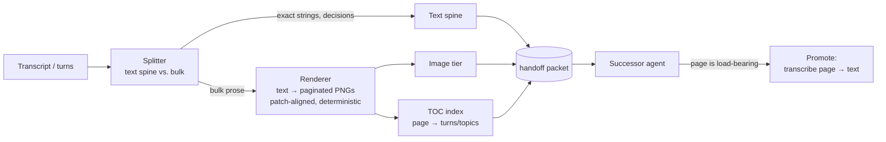

# microfiche

> Optical context compression for LLM agents: render conversation history as dense page
> images and hand off near-verbatim context at a fraction of the token cost — compaction
> that defers the "what matters" decision to read time instead of destroying information
> at write time.

## The idea

When an agent's context window fills, every current remedy — compaction summaries, handoff
notes, scratchpad files — is *lossy at write time*: something decides what matters before
knowing what the successor will need. Vision-language models offer a different trade. A
vision token covers a pixel region that can legibly render several words, so a page of
text ingested as an image costs roughly **4× fewer tokens** than the same text ingested as
text (published optical-compression results report up to ~10× at near-lossless
transcription). Rendered history is therefore a *cheaper, near-verbatim* memory tier, not
a summary.

microfiche packages this as a **handoff packet**:

- a **text spine** — decisions, file paths, IDs, exact strings that must survive byte-exact;
- an **image tier** — the bulk transcript rendered as paginated PNGs at ~4× density;
- a **table of contents** — a small text index mapping page → turn range/topic so the
  reading agent knows where to look;
- a **promotion API** — when an old page becomes load-bearing, the agent transcribes it
  back into text and reasons over it at full fidelity.

The name: microfiche was the technology of photographing documents at high density onto
film and reading them back through a magnifier. Same trick, new substrate. (Sibling
project, same naming lineage and shared lessons: [heliogram](https://github.com/zwaneldmz/heliogram).)

## Architecture

## What this is not

This is **not** heliogram's payload codec. heliogram measured (negatively) whether
*arbitrary high-entropy bytes* can ride vision tokens more cheaply than text tokens.
microfiche exploits the opposite regime: *semantically redundant, human-legible text* —
exactly the content vision towers are trained to preserve. The density advantage exists
only there, and the two results are consistent with each other.

## Status

Planning. See [PLAN.md](PLAN.md) — Phase 0 is a go/no-go experiment: at equal token
budgets, does rendered history beat a summary on recovery of discarded context? That
number, not the compression ratio, decides whether the rest gets built.

## License

Apache-2.0 (LICENSE file to be added at repo creation).
